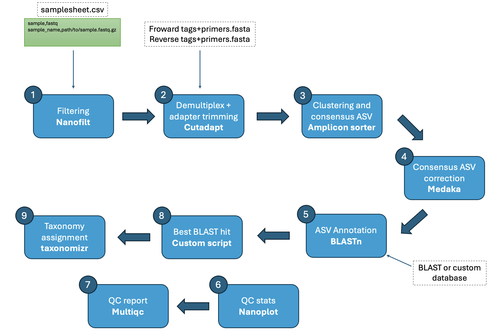

<!--
<h1>
  <picture>
    <source media="(prefers-color-scheme: dark)" srcset="docs/images/nf-core-nanoporemetabarcoding_logo_dark.png">
    
  </picture>
</h1>
-->

[](https://github.com/codespaces/new/nf-core/nanoporemetabarcoding)
[](https://github.com/nf-core/nanoporemetabarcoding/actions/workflows/nf-test.yml)
[](https://github.com/nf-core/nanoporemetabarcoding/actions/workflows/linting.yml)[](https://nf-co.re/nanoporemetabarcoding/results)[](https://doi.org/10.5281/zenodo.XXXXXXX)
[](https://www.nf-test.com)

[](https://www.nextflow.io/)
[](https://github.com/nf-core/tools/releases/tag/4.0.2)
[](https://docs.conda.io/en/latest/)
[](https://www.docker.com/)
[](https://sylabs.io/docs/)
[](https://cloud.seqera.io/launch?pipeline=https://github.com/nf-core/nanoporemetabarcoding)

[](https://nfcore.slack.com/channels/nanoporemetabarcoding)[](https://bsky.app/profile/nf-co.re)[](https://mstdn.science/@nf_core)[](https://www.youtube.com/c/nf-core)

## Introduction

**Eco-Flow/nanoporemetabarcoding** is a bioinformatics pipeline for processing nanopore metabarcoding data.

Overview:



Steps:

<!-- TODO nf-core:
   Complete this sentence with a 2-3 sentence summary of what types of data the pipeline ingests, a brief overview of the
   major pipeline sections and the types of output it produces. You're giving an overview to someone new
   to nf-core here, in 15-20 seconds. For an example, see https://github.com/nf-core/rnaseq/blob/master/README.md#introduction
-->

<!-- TODO nf-core: Include a figure that guides the user through the major workflow steps. Many nf-core
     workflows use the "tube map" design for that. See https://nf-co.re/docs/community/brand/workflow-schematics#examples for examples.   -->
<!-- TODO nf-core: Fill in short bullet-pointed list of the default steps in the pipeline -->

1. Filtering and trimming ([`NanoFilt`](https://github.com/wdecoster/nanofilt))
2. Read QC ([`NanoPlot`](https://github.com/wdecoster/NanoPlot))
   - Ran on both raw and filtered and trimmed reads
3. Tags+primer based demultiplexing and trimming ([`Cutadapt`](https://github.com/marcelm/cutadapt)). Divided in two steps:
   1. First, demultiplexing based on the forward tags-primers
   2. Then, demultiplexing based on matching reverse tags-primers (combination of forward and reverse tags-primers)
4. Group amplicons reads into "species" (consensus sequences) ([`amplicon_sorter`](https://github.com/avierstr/amplicon_sorter))
5. Consensus sequence correction ([`Medaka`](https://github.com/nanoporetech/medaka))
   - Correction using the consensus sequence from amplicon_sorter as reference and the grouped amplicon reads as the basecalled data
6. Create custom BLAST database ([`makeblastdb`](https://www.ncbi.nlm.nih.gov/books/NBK279690/))
7. Consensus sequence annotation based on database ([`blastn`](https://www.ncbi.nlm.nih.gov/books/NBK279690/))
   - Annotation is based on the best blast hit per consensus. And best blast hit is based on:
     1. First on the bit score
     2. Second on the e-value
8. Assign taxonomy to blast hits using taxonomizr ([`taxonomizr`](https://github.com/sherrillmix/taxonomizr)). Only works with NCBI accessions (GenBank and RefSeq). If an ASV has multiple hits with the same top bitscore, e-value, and percent identity, the lowest common taxonomic rank across all hits is assigned.

<!-- 1. Read QC ([`FastQC`](https://www.bioinformatics.babraham.ac.uk/projects/fastqc/))2. Present QC for raw reads ([`MultiQC`](http://multiqc.info/)) -->

## Usage

> [!NOTE]
> If you are new to Nextflow and nf-core, please refer to [this page](https://nf-co.re/docs/get_started/environment_setup/overview) on how to set-up Nextflow. Make sure to [test your setup](https://nf-co.re/docs/get_started/run-your-first-pipeline) with `-profile test` before running the workflow on actual data.

To use nanoporemetabarcoding, first clone this repo:

```bash
git clone https://github.com/Eco-Flow/nanoporemetabarcoding.git
```

Before running nanoporemetabarcoding on your data, you can test if the pipeline is suited to your setup by running:

```bash
nextflow run main.nf \
   -profile test,<docker/singularity/conda/.../institute> \
   --outdir <OUTDIR>
```

The running time should be around 8 minutes on a machine with 12 cpus/threads.

<!-- TODO nf-core: Describe the minimum required steps to execute the pipeline, e.g. how to prepare samplesheets.
     Explain what rows and columns represent. For instance (please edit as appropriate):
-->

For running the pipeline on your data, prepare a samplesheet with your input FASTQs that looks as follows:

```csv
id,fastq
fastq_id_1,path/to/reads1.fastq.gz
fastq_id_2,path/to/reads2.fastq.gz
...
```

The first column represents the FASTQ id (e.g. plate number if the FASTQ represents a single plate), and the second the location to the FASTQ file.

Now, you can run the pipeline using:

<!-- TODO nf-core: update the following command to include all required parameters for a minimal example -->

```bash
nextflow run main.nf \
   -profile <docker/singularity/.../institute> \
   --input samplesheet.csv \
   --outdir <OUTDIR>
```

> [!WARNING]
> Please provide pipeline parameters via the CLI or Nextflow `-params-file` option. Custom config files including those provided by the `-c` Nextflow option can be used to provide any configuration _**except for parameters**_; see [docs](https://nf-co.re/docs/running/run-pipelines#using-parameter-files).

<!-- For more details and further functionality, please refer to the [usage documentation](https://nf-co.re/nanoporemetabarcoding/usage) and the [parameter documentation](https://nf-co.re/nanoporemetabarcoding/parameters). -->

## Parameters

Check the config file `nextflow.config` in the params block and fill in the parameters with the proper values:

**Input options:**

You can optionally provide a metadata file in CSV format with the primer-tag combination in the first column and the corresponding sample name in the second column:

```
    // Metadata with primer combinations
    metadata                   = path/to/metadata.csv
```

The structure of the CSV should be as follows:

```
id,tag_primer,sample
fastq_id_1,<forward-primer-tag-id>_<forward-primer-tag-id>,sample1
fastq_id_2,<forward-primer-tag-id>_<forward-primer-tag-id>,sample2
...
```

> [!NOTE]
> If <forward-primer-tag-id> and/or <forward-primer-tag-id> in the metadata samplesheet don't match the ids in the primer-tag FASTA files, demultiplexing won't work. Make sure they have the exact same name.

The id of the metadata should match the id of the samplesheet (see [usage](#usage)), and values for the `tag_primer` and `sample` fields should be unique within id groups. See `./test_data/metadata.csv` for an example. If set to `null` (value by default), the pipeline will use the primer-tag combination as the sample ID in the final ASV table.

**Demultiplex options:**

1. List of forward primer-tag combinations in FASTA format:

```
    // Cutadapt options
    tags_f                      = 'path/to/forward/primer-tag.fasta' // List of forward primer-tag combinations in fasta format
```

2. List of reverse primer-tag combinations in FASTA format:

```
    tags_r                      = 'path/to/reverse/primer-tag.fasta' // List of forward primer-tag combinations in fasta format
```

3. Set the error rate for adapter removal. This can be a value between 0 and 1 (1 not included) if a maximum error rate wants to be applied to all adapters, or it can be equal or greater than 1, in which case it will be converted to a maximum error rate depending on the adapter length. Check [cutadapt documentation](https://cutadapt.readthedocs.io/en/stable/guide.html) for more information:

```
    error_rate                  = 2 // Error rate for adapter removal
```

4. Primer-tag overlap. To calculate mismatches with the `--error-rate` option, cutadapt considers only the aligned region (overlap) between primer and read. The minimum length of this overlap is set by the `--overlap` option. For example, with an error rate of 0.2 (20%) and a 20 bp primer, if the required overlap is 10 bp and there are 3 mismatches in that region, the match is rejected because the mismatch rate is 3/10 = 30%, which is above the 20% threshold. But if the overlap is 20 bp and there are 3 mismatches, the match is accepted because the mismatch rate is 3/20 = 15%, which is below the 20% threshold. If your primers are very similar, it is often best to set `--overlap` to at least the length of the longest primer to avoid spurious matches.

```
    overlap                     = null // Minimum overlap length for an adapter to be found
```

**Nanofilt options:**

1. Nanofilt is run before demultiplexing and tag+primer trimming:

```
    // Nanofilt options
    nano_quality                = null // Minimum read quality (phred score)
    nano_read_length            = 250 // Minimum reads length
```

2. Filter FASTQs with a number of reads equal or lower than (changing this value is not recommended):

```
    filt_fastq                  = 0
```

Check `./test_data/primers_f.fasta` and `./test_data/primers_r.fasta` for examples of `tags_f` and `tags_r` files, respectively.

**Blast options:**

1. Path to an already built blast database:

```
    blast_db                   = 'path/to/blast.db' // Path to already built database
```

2. Or build a local BLAST database from a collection of sequences:

```
    custom_db                  = 'path/to/local/database.fasta' // Path to database to be built
```

3. The E value describes the number of hits one can “expect” to see by chance when searching a database of a particular size. The lower the value, the more significant a match is:

```
    evalue                     = 0.001 // evalue cutoff
```

4. Maximum number of hits per query (consensus sequence):

```
    max_target_seqs            = 5 // Maximum number of hits per query
```

5. Maximum number of high-scoring segment pairs (HSPs) per subject (sequence in the database):

```
    max_hsps                   = null // Maximum number of HSPs per subject (subjects in the database)
```

6. Minimum query (consensus sequence) coverage per HSP:

```
    qcov_hsp_perc              = 90 // Minimum query coverage per HSP
```

For more details, check the appendix section of the [blast documentation](https://www.ncbi.nlm.nih.gov/books/NBK279690/).

<!-- You should supply **either** the path to an already built database or a custom FASTA collection with sequences to built a custom one. If both are supplied the pipeline will fail. -->

**Assign taxonomy options:**

1. Assign taxonomy at different levels based on an identity threshold:

```
    // Assign taxonomy options
    spident                     = null // Identity threshold (in %) for taxonomy assignment at species level. If not set, the value by default will be 99. Set to > 100 if not wanting to assign species
    gpident                     = null // Identity threshold (in %) for taxonomy assignment at genus level. If not set, the value by default will be 90
    fpident                     = null // Identity threshold (in %) for taxonomy assignment at family level. If not set, the value by default will be 80
    opident                     = null // Identity threshold (in %) for taxonomy assignment at order level. If not set, the value by default will be 70
```

2. Path to `taxonomizr` SQL database:

```
    sql_db                      = 'path/to/taxonomizr/database.sqlite' // Path to the taxonomizr SQLite database
```

**Command line arguments:**

Alternatively, instead of modifying the `nextflow.config` file, you can provide/modify pipeline options by specifying them as command line arguments. For example:

```bash
nextflow run main.nf \
   -profile <docker/singularity/.../institute> \
   --input samplesheet.csv \
   --outdir <OUTDIR>
   --nano_quality 10
   --evalue 1e-10
   --tags_f path/to/forward/tags+primers.fasta
   --tags_r path/to/reverse/tags+primers.fasta
   ...
```

## Pipeline output

<!-- To see the results of an example test run with a full size dataset refer to the [results](https://nf-co.re/nanoporemetabarcoding/results) tab on the nf-core website pipeline page.
For more details about the output files and reports, please refer to the
[output documentation](https://nf-co.re/nanoporemetabarcoding/output). -->

<!-- For an example of some of the relevant results check the `./results` folder in this repo. -->

The files listed below will be created in the results directory (set by `--outdir`) after the pipeline has finished. All paths are relative to the top-level results directory.

### Quality reports

#### Nanoplot

[`NanoPlot`](https://github.com/wdecoster/NanoPlot) is a tool that outputs QC reports for raw, filtered -after nanofilt-, and demultiplexed reads. Nanoplot reports are stored inside the nanoplot folder, and come in different formats.

<details markdown="1">
<summary>Output files</summary>

- `nanoplot/`
  - `raw/<fastq_id>`: Folder that contains the raw reads quality report.
  - `filtered/<fastq_id>`: Folder contains the filtered -after nanofilt- reads quality report.
  - `demultiplexed/<fastq_id>/<sample_id>`: Contains the demultiplexed reads quality report.

</details>

#### Multiqc

[MultiQC](http://multiqc.info) is a visualization tool that generates a single HTML report summarising all of the NanoPlot QC results for raw, filtered, demultiplexed reads. Most of the pipeline QC results are visualised in the report and further statistics are available in the report data directory.

<details markdown="1">
<summary>Output files</summary>

- `multiqc/`
  - `multiqc_report.html`: a standalone HTML file that can be viewed in your web browser.
  - `multiqc_data/`: directory containing parsed statistics from the different tools used in the pipeline.
  - `multiqc_plots/`: directory containing static images from the report in various formats.

</details>

### Taxonomy assignment

Each consensus sequence (ASV) is assigned a taxon using a two-step approach:

1. **Rank assignment by percent identity**: each BLAST hit is assigned to a taxonomic rank based on percent identity thresholds (species, genus, family, order) (see options **Assign taxonomy options:** in the [Parameters](#parameters) section).
2. **Last Common Rank (LCR) consensus**: because each ASV can have multiple BLAST hits, the final taxon is resolved by finding the most specific rank at which all hits agree. If hits disagree at the assigned rank, the pipeline falls back to progressively coarser ranks (genus → family → order → class → phylum) until a consensus is reached. If no consensus can be found, the ASV is labelled `Unassigned`.

The final output is `ASV_table_final.csv`, one row per ASV, with the following columns:

- `ASV`: ASV identifier.
- `sample_name`: Sample name, derived from the combination of FASTQ id and sample id.
- `read_count`: Number of reads assigned to the ASV.
- `pident`: Mean percent identity of the best BLAST alignment.
- `length`: Mean alignment length.
- `mismatch`: Mean number of mismatched positions in the alignment (excluding gaps).
- `evalue`: Expect value — the lower, the more significant the match. Depends on database size.
- `bitscore`: Bit score — the higher, the better the alignment. Independent of database size.
- `taxaId`: NCBI taxonomy ID of the matched sequence.
- `phylum`, `class`, `order`, `family`, `genus`, `species`: Full taxonomic lineage of the matched sequence.
- `Resolved.taxon`: Final consensus taxon assigned to the ASV. A trailing `*` indicates that one or more BLAST hits for the same ASV had no taxonomy in the database and were excluded from the LCR resolution. This ASV can be classified as `Unassigned` instead for a more conservative approach.

`ASV_table_pre-assigned.csv` contains the per-hit taxonomy assignments before LCR consensus resolution — one row per BLAST hit rather than one row per ASV.

<details markdown="1">
<summary>Output files</summary>

- `assign_taxa/`
  - `<fastq_id>/ASV_taxa_final.csv`: Taxonomy resolved ASV table with reads counts.
  - `<fastq_id>/ASV_taxa_final.csv`: Per-hit ASV table pre-taxonomy assignment.
  <!--  - `<fastq_id>/ASV_taxa.csv`: ASV table.
  - `<fastq_id>/ASV_filtered.csv`: ASV table with the assigned taxonomic rank according to the percetage identity parameters (see [Parameters](#parameters) section). -->

</details>

## Credits

Eco-Flow/nanoporemetabarcoding was originally written by Fernando Duarte, Chris Wyatt.

We thank the following people for their extensive assistance in the development of this pipeline:

<!-- TODO nf-core: If applicable, make list of people who have also contributed -->

## Contributions and Support

If you would like to contribute to this pipeline, please see the [contributing guidelines](docs/CONTRIBUTING.md).

For further information or help, don't hesitate to get in touch on the [Slack `#nanoporemetabarcoding` channel](https://nfcore.slack.com/channels/nanoporemetabarcoding) (you can join with [this invite](https://nf-co.re/join/slack)).

## Citations

<!-- TODO nf-core: Add citation for pipeline after first release. Uncomment lines below and update Zenodo doi and badge at the top of this file. -->
<!-- If you use nf-core/nanoporemetabarcoding for your analysis, please cite it using the following doi: [10.5281/zenodo.XXXXXX](https://doi.org/10.5281/zenodo.XXXXXX) -->

<!-- TODO nf-core: Add bibliography of tools and data used in your pipeline -->

An extensive list of references for the tools used by the pipeline can be found in the [`CITATIONS.md`](CITATIONS.md) file.

You can cite the `nf-core` publication as follows:

> **The nf-core framework for community-curated bioinformatics pipelines.**
>
> Philip Ewels, Alexander Peltzer, Sven Fillinger, Harshil Patel, Johannes Alneberg, Andreas Wilm, Maxime Ulysse Garcia, Paolo Di Tommaso & Sven Nahnsen.
>
> _Nat Biotechnol._ 2020 Feb 13. doi: [10.1038/s41587-020-0439-x](https://dx.doi.org/10.1038/s41587-020-0439-x).
